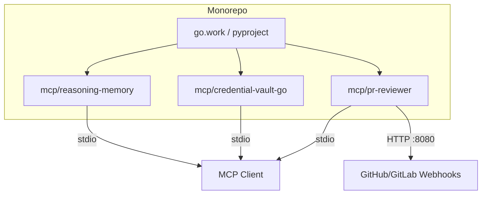

<!-- markdownlint-disable MD013 MD033 -->
<div align="center">

# 🧠 all-in-one-mcp

[](https://golang.org/)
[](https://python.org/)
[](https://modelcontextprotocol.io/)
[](./LICENSE)
[](https://github.com/ronaldyuwandika/all-in-one-mcp/actions)
[](./mcp)
[](https://github.com/ronaldyuwandika/all-in-one-mcp/releases)

**Personal collection of production-grade Model Context Protocol servers.**  
**3 MCPs · 2 languages · 1 unified developer experience.**

</div>

---

## ⚡ Quick Start

```bash
# Bootstrap everything (tools, deps, build)
make setup

# Run MCPs (stdio transport)
make run-reasoning-memory    # LLM reasoning trace capture
make run-credential-vault    # Encrypted credential management
make run-pr-reviewer         # Automated PR/MR review
```

---

## 📦 MCP Catalog

| MCP | Lang | Transport | Interfaces | Status |
|-----|------|-----------|------------|--------|
| [reasoning-memory](./mcp/reasoning-memory) | Go 1.24 | stdio | MCP (5 tools) | ✅ Stable |
| [credential-vault](./mcp/credential-vault-go) | Go 1.24 | stdio | MCP (9 tools) + CLI + TUI | ✅ Stable |
| [pr-reviewer](./mcp/pr-reviewer) | Python 3.12 | stdio + HTTP | MCP (5 tools) + Webhook | ✅ Stable |

---

## 🏗️ Architecture



### Server Summaries

| Server | Description |
|--------|-------------|
| **reasoning-memory** | Captures and consolidates LLM reasoning traces; exposes semantic search and episode injection over stdio |
| **credential-vault** | Encrypts, scans, masks, and restores secrets from env/files; full CLI + TUI interface |
| **pr-reviewer** | Automated code review engine for GitHub & GitLab PRs/MRs; HTTP webhook + stdio MCP |

---

## 🛠️ Development Workflow

```bash
make dev           # Hot reload (all servers)
make test-all      # All tests + coverage (≥80%)
make lint-all      # golangci-lint + ruff + hadolint + markdownlint
make bench-all     # Benchmarks
make security      # gosec + govulncheck + pip-audit
make doctor        # Health check all MCPs
```

> **Prerequisites:** Go 1.24+, Python 3.12+, `make`  
> Run `make setup` once to install all tooling dependencies automatically.

---

## ⚙️ Configuration Matrix

| MCP | Config File | Key Variables |
|-----|-------------|---------------|
| reasoning-memory | `~/.reasoning-memory/config.yaml` | Embedding provider, consolidation thresholds |
| credential-vault | `~/.config/vaultctl/config.yaml` | Scan targets, redaction patterns |
| pr-reviewer | `~/.config/reviewerctl/config.yaml` | GitHub/GitLab tokens, LLM provider, review rules |

Each server ships with a commented example config. Copy and adjust:

```bash
cp mcp/reasoning-memory/config.example.yaml ~/.reasoning-memory/config.yaml
cp mcp/credential-vault-go/config.example.yaml ~/.config/vaultctl/config.yaml
cp mcp/pr-reviewer/config.example.yaml     ~/.config/reviewerctl/config.yaml
```

---

## 📊 Benchmarks

Latest benchmark results (run `make bench-all` to regenerate):

| Benchmark | p50 | p99 |
|-----------|-----|-----|
| Reasoning Memory — semantic search | see results | [→](./mcp/reasoning-memory/bench/results/search.md) |
| Credential Vault — encrypt/decrypt, scan, redact, mask, audit | run locally | [→](./mcp/credential-vault-go/bench/results/) |
| PR Reviewer — diff parse | see results | [→](./mcp/pr-reviewer/bench/results/diff-parse.md) |

Full result files:

- [Reasoning Memory Search](./mcp/reasoning-memory/bench/results/search.md)
- [Credential Vault Benchmarks](./mcp/credential-vault-go/bench/results/)
- [PR Reviewer Diff Parse](./mcp/pr-reviewer/bench/results/diff-parse.md)

---

## 🤝 Contributing

Contributions are welcome! Please follow these guidelines:

1. **Conventional Commits** — all commit messages must follow [Conventional Commits](https://www.conventionalcommits.org/) (e.g., `feat:`, `fix:`, `docs:`, `chore:`)
2. **Tests** — `make test-all lint-all` must pass before opening a PR
3. **Coverage** — unit test coverage must be **≥ 80%** on all changed files
4. **Benchmarks** — add benchmarks for any performance-critical code paths
5. **Branch naming** — `feat/<issue>-short-description`, `fix/<issue>-...`, `docs/<issue>-...`

```bash
# Before submitting a PR:
make test-all lint-all
```

---

## 📄 License

This project is licensed under the **MIT License** — see [LICENSE](./LICENSE) for details.

---

<div align="center">
<sub>Built with ❤️ by <a href="https://github.com/ronaldyuwandika">Ronald Dimas Yuwandika</a></sub>
</div>
