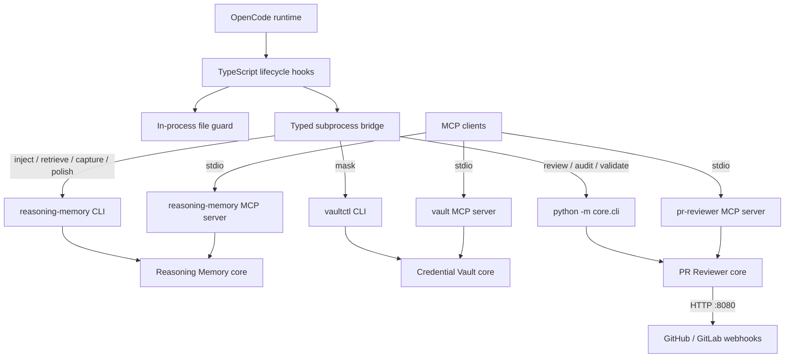

<!-- markdownlint-disable MD013 MD033 -->
<div align="center">

# all-in-one-mcp

[](https://go.dev/)
[](https://python.org/)
[](https://www.typescriptlang.org/)
[](https://modelcontextprotocol.io/)
[](./LICENSE)

**Hybrid Model Context Protocol (MCP) servers and OpenCode plugins for reasoning memory, credential protection, and pull request review.**

</div>

---

## Architecture

The repository supports two integration paths over the same native components:

- **OpenCode plugin:** lifecycle hooks run lightweight guards in-process and call native Go/Python headless CLIs over bounded subprocess bridges.
- **Standalone MCP:** the existing stdio servers remain available with their original tools and behavior for MCP clients.


```mermaid
flowchart TB
    OC[OpenCode runtime] --> PH[TypeScript lifecycle hooks]
    PH --> FG[In-process file guard]
    PH --> BR[Typed subprocess bridge]

    BR -->|inject / retrieve / capture / polish| RMCLI[reasoning-memory CLI]
    BR -->|mask| VCLI[vaultctl CLI]
    BR -->|review / audit / validate| PRCLI[python -m core.cli]

    RMCLI --> RMCORE[Reasoning Memory core]
    VCLI --> VCORE[Credential Vault core]
    PRCLI --> PRCORE[PR Reviewer core]

    MC[MCP clients] -->|stdio| RMS[reasoning-memory MCP server]
    MC -->|stdio| VS[vault MCP server]
    MC -->|stdio| PRS[pr-reviewer MCP server]

    RMS --> RMCORE
    VS --> VCORE
    PRS --> PRCORE
    PRCORE -->|HTTP :8080| WH[GitHub / GitLab webhooks]
```

The plugin path adds editor lifecycle integration without replacing the MCP path. Existing stdio MCP configurations remain backward compatible.

## Repository Layout

```text
.
├── .opencode/
│   └── opencode.json             # Supported OpenCode local plugin configuration
├── mcp/
│   ├── reasoning-memory/         # Go MCP server and headless CLI
│   ├── credential-vault-go/      # Go MCP server, vaultctl CLI, and TUI
│   └── pr-reviewer/              # Python MCP server, webhook service, and CLI
├── pkg/
│   └── secretdetect/             # Shared Go secret detection and redaction module
├── plugins/                      # TypeScript OpenCode plugin workspace
│   ├── src/file-guard.ts
│   ├── src/bridge/subprocess.ts
│   ├── src/clients/
│   └── src/hooks/
├── go.work                       # reasoning-memory, credential-vault-go, secretdetect
└── Makefile                      # Unified native and plugin workflows
```

`mcp/credential-vault-go` is the current credential vault path; references to the former `mcp/credential-vault` path should be updated.

## Components

| Component | Language | Interfaces | Purpose |
|---|---|---|---|
| [reasoning-memory](./mcp/reasoning-memory) | Go 1.25 | MCP stdio, headless CLI, TUI | Capture, retrieve, inject, polish, and consolidate agent reasoning memory |
| [credential-vault-go](./mcp/credential-vault-go) | Go 1.25 | MCP stdio, `vaultctl`, TUI | Encrypt, scan, mask, audit, and restore local credentials |
| [pr-reviewer](./mcp/pr-reviewer) | Python 3.12 | MCP stdio, headless CLI, HTTP webhook | Review GitHub and GitLab changes with configurable LLM providers |
| [plugins](./plugins) | TypeScript 5.8 | OpenCode plugin hooks | Add in-process file guarding and lifecycle-driven native CLI integration |
| [secretdetect](./pkg/secretdetect) | Go 1.25 | Shared package, CLI | Provide deterministic secret detection and redaction |

## Installation

### Prerequisites

- Go 1.25+
- Python 3.12+
- Node.js 20.19+ or 22.12+
- npm and `make`

Install all native components, install plugin dependencies, and build the TypeScript plugin:

```bash
make all
```

Equivalent explicit steps:

```bash
make setup
make setup-plugins
make build-plugins
```

Native binaries are installed under `~/mcp/bin`. The PR reviewer is installed into `mcp/pr-reviewer/.venv`, and the plugin is compiled to `plugins/dist/`.

## OpenCode Plugin

The plugin entrypoint is `plugins/dist/index.js`, registered in `.opencode/opencode.json` (`"plugin": [["../plugins/dist/index.js", { ... }]]`). The default export implements the `@opencode-ai/plugin` interface, providing four lifecycle hooks:

| Hook | OpenCode Event / Trigger | Behavior |
|---|---|---|
| `chat.message` | User prompt submission | Intercepts user prompt before inference, calls `reasoning-memory inject --json`, and prepends relevant `<reasoning_memory>` context to message text parts |
| `tool.execute.before` | Pre-tool execution | Evaluates path arguments with `FileGuard` (observed sub-0.1ms average on modern hardware); synchronously throws to block access to sensitive paths (`.env`, `credentials.env`, `~/.config/gcloud/**`, `~/.azure/**`, `~/.ssh/**`, `~/.config/gh/hosts.ya?ml`, kubeconfig, private keys) |
| `tool.execute.after` | Post-tool execution | Streams tool output through `vaultctl mask` (with fallback to in-process token masking) and records tool calls |
| `event` | `session.idle` event | Formats task problem, tool calls, outcome, and duration, capturing an episode via `reasoning-memory capture --json` |

The typed subprocess bridge streams stdin, limits execution time and output size, masks sensitive error text, and uses per-component circuit breakers. Typed clients are also available for reasoning retrieval/polishing, vault operations, and PR review/audit/validation.

See [plugins/README.md](./plugins/README.md) for configuration, security behavior, architecture, and tests.

## Running Standalone MCP Servers

```bash
make run-mcp-reasoning-memory
make run-mcp-credential-vault
make run-mcp-pr-reviewer
```

These commands preserve the standalone stdio MCP server workflow. The PR reviewer also retains its HTTP webhook service.

## Headless CLI Examples

The plugin bridge uses stdin streaming so prompts, diffs, and text do not need temporary files.

```bash
# Reasoning memory
printf '%s' 'How should retries be implemented?' | reasoning-memory inject --json
printf '%s' 'retry strategy' | reasoning-memory retrieve --json
printf '%s' '{"problem":"Add retry handling","outcome":"success"}' | reasoning-memory capture --json
printf '%s' 'add retries to this worker' | reasoning-memory polish --json

# Credential masking
printf '%s' 'token=example-secret' | vaultctl mask

# PR reviewer (run from mcp/pr-reviewer)
printf '%s' "$DIFF" | .venv/bin/python -m core.cli review --stdin
.venv/bin/python -m core.cli audit --limit 20
.venv/bin/python -m core.cli validate
```

See each component README for complete options and input formats.

## Development Commands

```bash
make build                   # Build reasoning-memory and TypeScript plugins
make lint                    # Lint/type-check Go, Python, and TypeScript
make test                    # Run native and plugin test suites
make all                     # Install native components and build plugins

make setup-plugins           # npm install in plugins/
make build-plugins           # npm run build
make lint-plugins            # npm run lint
make test-plugins            # npm test

make test-reasoning-memory
make test-credential-vault
make test-pr-reviewer
make test-secretdetect
make bench-all
```

`build`, `lint`, `test`, and `all` include the plugin workflow where applicable.

## Configuration

| Component | Configuration |
|---|---|
| OpenCode plugin | `.opencode/opencode.json` |
| reasoning-memory | `~/.reasoning-memory/config.yaml` or `REASONING_MEMORY_CONFIG` |
| credential-vault-go | `~/.config/vaultctl/config.yaml` or `CREDENTIAL_VAULT_*` variables |
| pr-reviewer | `mcp/pr-reviewer/config.yaml`, `PR_REVIEWER_CONFIG`, and provider environment variables |

Start from the checked-in configuration files:

```bash
mkdir -p ~/.reasoning-memory ~/.config/vaultctl
cp mcp/reasoning-memory/config.yaml ~/.reasoning-memory/config.yaml
cp mcp/credential-vault-go/config.example.yaml ~/.config/vaultctl/config.yaml
```

The PR reviewer loads `mcp/pr-reviewer/config.yaml` by default; pass `--config` to `python -m core.cli` or set `PR_REVIEWER_CONFIG` to use another file.

## Contributing

1. Use Conventional Commits such as `feat:`, `fix:`, `docs:`, or `chore:`.
2. Add tests for changed behavior.
3. Run the repository checks before opening a pull request:

```bash
make test lint-check
```

## License

This project is licensed under the MIT License. See [LICENSE](./LICENSE).
