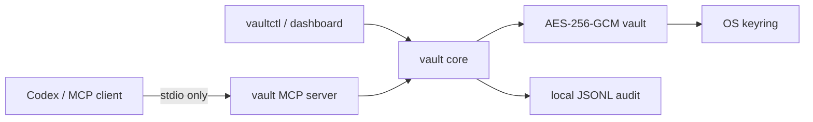

# Credential Vault Go

[](https://go.dev/) [](https://modelcontextprotocol.io/) [](../../LICENSE)

Local encrypted credential storage and controlled access for Codex and other MCP clients. Secrets are encrypted with AES-256-GCM, the master key is held by the operating-system keyring under `com.credential-vault.go`, and every read is purpose-audited.

## Features

- Scans local files for common secret assignments and provider token formats.
- Encrypts the vault and file backups with authenticated AES-256-GCM.
- Stores the 256-bit master key in macOS Keychain through `go-keyring`.
- Redacts originals while preserving file modes, then restores from encrypted backups.
- Masks secrets in arbitrary output and offers timeout-bounded `run_safe` execution.
- Records append-only JSONL audit events with mode `0600`.
- Provides a stdio MCP server, Cobra CLI, and Bubble Tea dashboard.
- Exports and imports encrypted vault bundles.

The keyring library supports macOS, Linux Secret Service, and Windows Credential Manager; unattended keychain access still depends on the host session and policy.

## Quick start

```bash
make install-mcp-credential-vault
./mcp/credential-vault-go/vaultctl scan ~/.config
./mcp/credential-vault-go/vaultctl dashboard
./mcp/credential-vault-go/vault
```

## Interfaces

| Interface | Command | Description |
|---|---|---|
| MCP server | `vault` | Local stdio transport with nine tools |
| CLI | `vaultctl` | Scriptable vault administration |
| TUI | `vaultctl dashboard` or `watch` | Live credentials, audit, files, and system tabs |

## MCP tools

| Tool | Required parameters | Description |
|---|---|---|
| `vault_status` | — | Return counts and local health metadata, never values |
| `vault_get` | `name`, `purpose` | Retrieve and audit one credential |
| `vault_set` | `name`, `value` | Encrypt a credential supplied locally |
| `vault_chat_clear` | — | Remove chat-origin credentials |
| `vault_mask` | `text` | Redact recognized secrets |
| `vault_scan` | optional `path`, `redact` | Scan a local directory |
| `vault_restore` | — | Restore encrypted file backups |
| `vault_audit` | — | Read recent audit entries |
| `run_safe` | `command` | Run locally and mask combined output |

## CLI reference

```bash
vaultctl status
vaultctl get <name> --purpose "deploy" --quiet
vaultctl set <name>                  # reads the value from stdin
vaultctl scan [path] [--no-redact]
vaultctl restore
vaultctl audit --limit 50
vaultctl stats --format json
vaultctl doctor --format json
vaultctl dashboard --interval 2s
vaultctl export backup.json
vaultctl import backup.json
vaultctl chat-clear
```

## Migrating the Python vault

The Go vault uses a separate keychain service and directory so migration cannot overwrite the legacy Fernet key. Stream the legacy vault directly into the installed Go CLI; do not redirect the stream to disk or a terminal:

```bash
python3 scripts/migrate_credential_vault.py \
  --legacy-dir ~/.credential-vault \
  | vaultctl migrate-stdin
```

The migration re-encrypts credential values, file backups, and audit records locally. It is additive: existing Go records are retained, and the legacy vault remains available as a rollback source until you explicitly remove it.

## Configuration

The optional file is `~/.config/vaultctl/config.yaml`; flags override environment, environment overrides file, and file overrides defaults.

```yaml
vault_dir: ~/.credential-vault-go
scan_targets:
  - .
dashboard_interval_seconds: 2
```

Environment variables use the `CREDENTIAL_VAULT_` prefix. `CREDENTIAL_VAULT_DIR` is useful for isolated automation. `CREDENTIAL_VAULT_TEST_KEY` is only for deterministic tests and must not be used in production.

## Architecture



- `internal/crypto` — authenticated encryption and keyring adapter.
- `internal/vault` — storage, scanning, restore, audit, masking integration, stats, and doctor.
- `pkg/secretdetect` — shared deterministic detection and redaction used by the vault and reasoning-memory; provider patterns are defined only here.
- `internal/mcp` — local stdio tools.
- `internal/cli` and `internal/tui` — command and dashboard interfaces.

## Benchmarks and accuracy

Run `make bench-credential-vault` from the repository root. The suite measures 1 KiB encrypt/decrypt, 100-file scans, 1 MiB redaction, 10 KiB masking, and audit appends with `ns/op`, bytes, and allocations. `accuracy_test.go` is a deterministic CI regression corpus for precision, recall, and redaction completeness; it does not download secrets or transmit test data.

Measured results are environment-dependent, so this README does not claim synthetic p50/p99 values. Keep raw `go test -bench` output as a CI artifact when comparing branches.

## Security limits

- Detection is pattern-based and cannot guarantee discovery of every custom secret format.
- Shared findings contain only type, byte range, confidence, and a truncated SHA-256 fingerprint; they never contain the detected value.
- High-entropy detection is intentionally conservative to reduce false positives. Git hashes, UUIDs, ordinary checksums, and low-diversity identifiers are excluded.
- Directory scans skip files larger than 2 MiB, binary files, `.git`, and `node_modules`.
- `run_safe` invokes `/bin/sh -c`; only run trusted commands. Its output is local and masked, but the child command may itself access the network.
- A user who can access the unlocked host keyring can decrypt the vault.
- Key rotation and real-time filesystem watching are not implemented.

## Troubleshooting

| Symptom | Action |
|---|---|
| Keychain access denied | Grant the terminal/Codex process keychain access and rerun `vaultctl doctor` |
| Vault cannot decrypt | Restore the matching OS keyring item; encrypted data cannot be recovered without it |
| Scan is slow | Target a narrower directory and exclude generated dependency trees |
| Dashboard cannot open | Run it in an interactive terminal with `TERM` set |

## License

MIT
